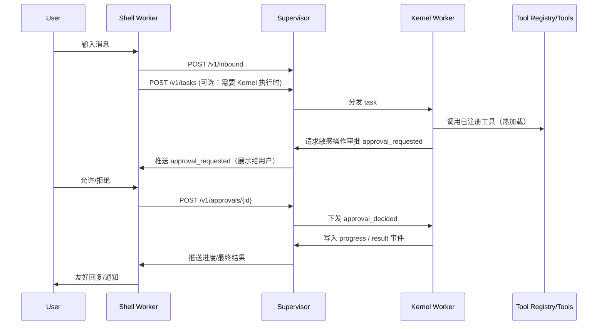

# Clonoth 架构与实施计划（Python）— 自举 / 自进化 Agent 基座

## 0. 背景与目标
Clonoth 的目标是成为一个“自进化/自举”的个人 Agent 基座：我们只手写最小且可靠的框架（Bootstrapper），其余能力（工具、工作流、适配器、甚至部分运行时逻辑）尽可能由 Agent 自己在运行中生成、热加载与迭代。

本计划聚焦于：
- **可落地**：能跑起来、能持续迭代、能自我修复。
- **可恢复**：支持热更新与重启后的会话续接。
- **可控**：在尽量自动化的同时，保留关键动作的人工确认与回滚能力。

## 1. 已确认的关键决策
- 语言：**Python**。
- 持久化：先使用 **JSON**，推荐以 **JSONL 事件日志（event sourcing）**作为主存储；可选增加 snapshot。
- LLM 上游：需要适配 **OpenAI / Gemini / Anthropic** 三种主流 tool-calling 格式，抽象为统一的 Provider Adapter。
- 外部渠道（Telegram/Discord 等）：**后做**。先暴露稳定 Gateway API，外部 bot/适配器可独立实现并接入。
- 外部聊天层（Shell）需要自进化；因此**安全确认与状态存储不能依赖 Shell**，必须由更稳定的控制面兜底。
- 暂不引入 Docker 等强沙盒（对本地文件操作不友好）；先采用 **权限分级 + 人类确认 + 健康检查 + 回滚 + Safe Mode**。

## 2. 总体架构（组件、边界与职责）
### 2.1 组件划分（建议采用多进程 Supervisor-Worker）
1) **Supervisor（Root of Trust / 控制面，尽量稳定、尽量小）**
- 提供 Gateway API（对内对外统一入口）。
- 统一写入事件日志（JSONL）并派生状态（任务/会话/审批）。
- 实现权限策略（Policy Engine）与审批（Approval）绑定。
- 进程管理：启动/停止/重启 Shell、Kernel；健康检查；失败回滚；进入 Safe Mode。

2) **Shell Worker（对话与路由层，可进化）**
- 面向用户的对话体验（MVP 可先做 CLI）。
- 维护“用户沟通上下文”（可滚动摘要）。
- 将复杂任务结构化下发给 Kernel（Task）。
- 接收 Kernel 的进度/结果并对用户展示。

3) **Kernel Worker（执行与自举层，可进化）**
- 执行“思考 → 工具调用 → 观察”循环。
- 维护 tools/ 的动态注册表（热加载）。
- 遇到敏感动作（写 core、执行命令、重启关键组件等）时，向 Supervisor 发起审批请求并等待决策。

4) **Tools（Evolving Space，可热加载）**
- AI 生成/更新的工具模块，保存在 `tools/`。
- 工具可以快速迭代；失败应可被捕获并反馈给 Kernel 自我修复。

5) **LLM Provider Adapters（OpenAI/Gemini/Anthropic）**
- 将不同厂商的消息/工具/返回格式映射为统一内部协议（见第 5 章）。

6) **External Channel Adapters（TG/Discord，后续）**
- 外部 bot 只需将消息转换为 Gateway API 的 `POST /v1/inbound`，并订阅输出流即可。

### 2.2 数据流（概览）


### 2.3 重启与热更新的分级
- **工具热加载（Hot reload）**：仅变更 `tools/`，无需重启。
- **Kernel 重启**：Kernel 运行时代码变更（或状态异常）时重启 Kernel，不中断对话。
- **Shell 重启**：Shell 代码变更时重启 Shell；Supervisor 保留会话状态与待审批队列，Shell 恢复后继续。
- **Supervisor 重启（全量）**：仅在控制面代码变更时使用；通过事件日志恢复会话与任务。

## 3. 持久化与会话恢复（JSONL Event Sourcing）
### 3.1 事件日志（推荐 JSONL）
文件：`data/events.jsonl`（append-only，一行一条 JSON）。

最小不可变事件结构（v1）：
```json
{
  "schema_version": 1,
  "event_id": "uuid",
  "ts": "2026-03-01T12:00:00+08:00",
  "run_id": "uuid",
  "session_id": "uuid",
  "component": "supervisor|shell|kernel|channel:xxx",
  "type": "boot|inbound_message|outbound_message|task_created|task_progress|tool_call|tool_result|approval_requested|approval_decided|restart_requested|restart_completed|error",
  "payload": {}
}
```

说明：
- `run_id`：每次启动生成新的 run_id。
- `session_id`：跨重启稳定，用于绑定一次用户会话。
- `payload`：可扩展字段，允许演进。

### 3.2 派生状态（Derived State）
Supervisor 从事件流派生出：
- 会话列表与会话摘要（rolling summary 可选）。
- 任务队列：pending / running / blocked_for_approval / done / failed / cancelled。
- 待审批队列（Approval Queue）：包含请求原文、请求哈希/指纹、状态与决策。

### 3.3 会话标识（session_id）与 conversation_key
- `conversation_key` 来自外部渠道（例如 `tg:chat_id:user_id`）。
- Supervisor 维护 `conversation_key -> session_id` 映射（可存 `data/sessions.json` 或从事件流重建）。

### 3.4 重启后“AI 知道刚刚重启了”
Supervisor 启动后写入 `boot` 事件，并在 Shell/Kernel 启动时注入 Boot Context（例如：是否为重启、原因、未完成任务、待审批列表）。

建议：将 Boot Context 作为 system prompt 的第一段或作为 Kernel/Shell 的启动参数，从而保证模型显式知晓。

### 3.5 幂等与去重（避免重启后重复执行）
- 每次 tool call、命令执行、文件写入等都要携带 `tool_call_id`（uuid）。
- Supervisor/Kernel 应记录 tool_call 的“开始/结束”事件：
  - 如果发现某 `tool_call_id` 已完成，则重启后不重复执行。
  - 若只有开始没有结束（未知状态），默认进入 `blocked_for_approval` 或要求 Kernel 做幂等检查（文件是否已存在、git 状态等）。

## 4. Gateway API（对外暴露的稳定接口，v1）
为了后续 TG/Discord 等外部 bot 接入，Supervisor 提供稳定 API（先本地 `localhost`）。

建议的最小 API：
1) **消息入口**
- `POST /v1/inbound`
  - 输入：`{ channel, conversation_key, message_id, text, attachments? }`
  - 输出：`{ session_id, accepted }`

2) **会话输出流（推送 outbound、进度、审批）**
- `GET /v1/sessions/{session_id}/stream`（推荐 SSE；MVP 可先轮询）

3) **任务接口（Shell → Kernel）**
- `POST /v1/tasks`：创建任务（payload 包含 session_id、instruction、priority、context_ref 等）
- `GET /v1/tasks/next`：Kernel 拉取下一任务
- `POST /v1/tasks/{task_id}/events`：Kernel 上报进度/中间结果

4) **审批接口（执行命令/写核心代码/重启等敏感操作）**
- `POST /v1/approvals/{approval_id}`：`{ decision: "allow"|"deny", comment? }`

5) **管理与安全模式**
- `GET /v1/health`
- `POST /v1/admin/restart`：`{ target: "shell"|"kernel"|"all" }`
- `POST /v1/admin/rollback`：回滚到上一个可用版本（实现策略见第 7 章）
- `GET /v1/admin/state`：查看待审批/任务状态（Safe Mode 可直接用）

## 5. LLM Provider Adapter（OpenAI / Anthropic / Gemini）
目标：将不同厂商的 tool calling 统一成内部协议，避免在 Shell/Kernel 中写分支逻辑。

### 5.1 内部统一协议（建议）
- `Message`: `{ role: system|user|assistant|tool, content, name?, tool_call_id? }`
- `ToolSpec`: `{ name, description, input_schema(JSON Schema), safety_level? }`
- `ToolCall`: `{ id, name, arguments(dict) }`
- `LLMResponse`: `{ text, tool_calls[] }`

### 5.2 Adapter 职责
- 将内部 `messages + tools` 编码为 OpenAI/Gemini/Anthropic 的请求格式。
- 将响应解析为 `LLMResponse`（包括 tool_calls）。
- 处理厂商差异：
  - OpenAI：`tools` + `tool_calls`
  - Anthropic：content blocks（tool_use/tool_result）
  - Gemini：functionDeclarations/functionCall

## 6. Tool 系统（tools/ 热加载 + Meta Tools）
### 6.1 工具契约（建议先显式声明，降低自动推断复杂度）
每个工具模块建议包含：
- `SPEC`：内部 `ToolSpec`（至少 name/description/input_schema）
- `run(args, ctx)`：执行函数（建议支持 async）

Registry 扫描 `tools/`，加载/重载模块，构建 tool 列表提供给 LLM。

### 6.2 Meta Tools（基座内置、受策略保护）
Meta Tools 用于让 Agent 改变世界与改造自身，例如：
- 文件读写：`read_file`、`write_file`
- 搜索与目录：`list_dir`、`search_in_files`
- 执行命令：`execute_command`
- 生命周期：`request_restart(target, reason)`、`reload_tools`

注意：Meta Tools 的敏感操作必须走 Supervisor 的策略与审批。

### 6.3 权限分级与审批（Policy + Approval）
采用三档策略（由 Supervisor 强制）：
- **L1 自动执行**：读文件、列目录、写入 `tools/` 与 `data/` 等低风险操作。
- **L2 需要显式审批**：执行 shell 命令、写入/覆盖 `core/` 或关键目录、请求重启。
- **L3 硬拒绝**：明显破坏性命令或路径（可配置 denylist）。

补充建议：
- 命令策略：allowlist（可自动放行） + denylist（硬拒绝） + 默认需要审批。
- 路径策略：限定可写路径；对核心路径写入默认审批。
- 用户随时可发送 `STOP`/`CANCEL` 取消当前任务（Kill Switch）。

## 7. 升级、健康检查与回滚
自进化必然会改坏自己，必须把“自救”写进基座。

建议流程：
1) 关键变更前自动备份（最简单：git commit 或复制备份目录）。
2) 执行变更后重启目标组件（shell/kernel）。
3) 启动后做 healthcheck（能否加载工具注册表、能否响应 API）。
4) 连续失败触发回滚（恢复备份或 git reset），并进入 Safe Mode。

建议加“重启风暴保护”：单位时间内最多重启 N 次，超过则自动进入 Safe Mode。

## 8. Safe Mode（安全模式，最低可用面）
当 Shell/Kernel 崩溃、升级失败或无法展示审批时，Supervisor 进入 Safe Mode：
- 提供最小 CLI 或最小 HTTP 管理页（不依赖 LLM）。
- 能查看最近错误、待审批请求、任务队列。
- 能手动 allow/deny 审批。
- 能触发 rollback / restart。

## 9. 目录结构规划（建议）
```text
Clonoth/
├── supervisor/             # Root of Trust：API、事件日志、策略、进程管理、Safe Mode
│   ├── __init__.py
│   ├── main.py
│   ├── api.py
│   ├── eventlog.py
│   ├── policy.py
│   ├── process_manager.py
│   └── types.py            # Event/Task/Approval/Envelope 定义
├── shell/                  # 可进化：对话体验、任务路由（MVP 可先 CLI）
│   ├── __init__.py
│   └── worker.py
├── kernel/                 # 可进化：执行循环、工具注册、编写工具
│   ├── __init__.py
│   ├── worker.py
│   ├── registry.py
│   └── meta_tools.py
├── providers/              # OpenAI/Gemini/Anthropic Provider Adapters
│   ├── __init__.py
│   ├── openai.py
│   ├── anthropic.py
│   └── gemini.py
├── tools/                  # 演化空间：AI 自己写的工具（热加载）
│   ├── __init__.py
│   └── ...
├── data/                   # 事件日志、snapshot、记忆等
│   ├── events.jsonl
│   └── ...
├── main.py                 # 启动入口（启动 supervisor）
└── requirements.txt
```

## 10. 迭代路线图（建议）
1) Supervisor 骨架：eventlog + policy + process manager + Safe Mode
2) Gateway API（v1）：inbound/stream/tasks/approvals/admin
3) Provider Adapter：先实现一个（建议 OpenAI），跑通 tool calling；再补齐 Anthropic/Gemini
4) Shell CLI：最小可用对话 + 任务下发 + 审批展示
5) Kernel：工具注册表（热加载）+ Meta Tools + 自举写工具闭环
6) 进化里程碑：让 Clonoth 自己写第一个工具（如 web_search 或 memory_manager）并热加载
7) 外部渠道：TG/Discord bot 通过 Gateway API 接入（后续）

---

## TODO LIST

<!-- LIMCODE_TODO_LIST_START -->
- [ ] 定义并固化 JSONL 事件模型（Event Schema v1）与派生状态重建逻辑  `#design_event_schema`
- [ ] 实现 Supervisor：eventlog + policy + 进程管理 + Safe Mode 基础框架  `#impl_supervisor_core`
- [ ] 实现 Gateway API（v1）：inbound/stream/tasks/approvals/admin  `#impl_gateway_api`
- [ ] 实现 Provider Adapter：OpenAI（优先），并预留 Anthropic/Gemini 接口  `#impl_llm_providers`
- [ ] 实现 Shell Worker（MVP：CLI）与会话恢复（从事件流重建）  `#impl_shell_worker`
- [ ] 实现 Kernel Worker：任务循环 + 工具调用 + 与 Supervisor 的审批交互  `#impl_kernel_worker`
- [ ] 实现 tools/ Registry：热加载、异常捕获与 tool schema 汇总  `#impl_tool_registry`
- [ ] 实现 Meta Tools：读写文件/执行命令/请求重启（接入 Policy+Approval）  `#impl_meta_tools`
- [ ] 初始化项目结构与最小 requirements.txt  `#init_structure`
- [ ] （后续）实现外部渠道适配器（TG/Discord）接入 Gateway API  `#future_channel_adapters`
<!-- LIMCODE_TODO_LIST_END -->
