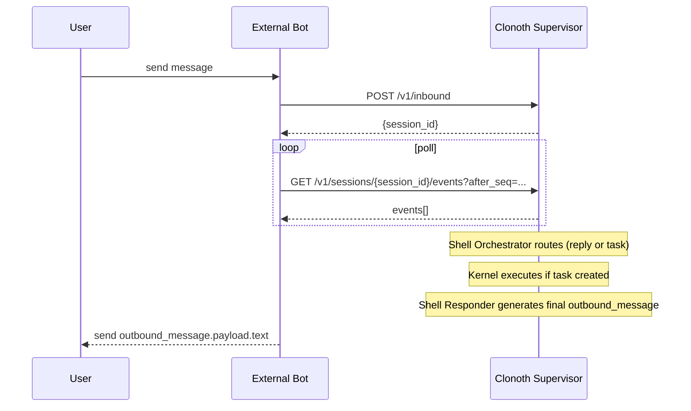

# 外部 Bot 接入指南（Telegram / Discord / 任意 Adapter）

本文档面向 **外部渠道适配器（Channel Adapter / Gateway）** 的开发者。

目标：把 Telegram/Discord/企业微信等外部平台的消息转发到 Clonoth，并把 Clonoth 的回复/进度/审批事件再转发回外部平台。

Clonoth 的定位是“后端智能体基座”，外部 Bot 只需要做三件事：

1) 把用户输入变成 `POST /v1/inbound`
2) 轮询事件流 `GET /v1/sessions/{session_id}/events`
3) 遇到审批请求时，把 allow/deny 决策写回 `POST /v1/approvals/{approval_id}`

---

## 1. 基本概念

### 1.1 channel / conversation_key / session_id

- `channel`：外部渠道名，例如 `telegram` / `discord` / `cli`
- `conversation_key`：外部会话的稳定标识（你自己定义）
  - Telegram：建议 `telegram:{chat_id}`
  - Discord：建议 `discord:{channel_id}` 或 `discord:{guild_id}:{channel_id}`
- `session_id`：Clonoth 内部会话 id，由 Supervisor 创建并返回
  - Supervisor 内部会维护 `conversation_key -> session_id` 映射

### 1.2 message_id（强烈建议提供）

`/v1/inbound` 支持传 `message_id`：外部平台的消息唯一 id。

注意：Supervisor **当前不会对 message_id 去重**。

因此：如果你的平台是 at-least-once 投递（常见），你必须在 Adapter 层自行去重：

- 去重 key 建议：`(channel, conversation_key, message_id)`
- 存储建议：
  - 单实例：内存 dict / 本地 sqlite
  - 多实例：Redis / 数据库（避免重复上报）

### 1.3 use_context：谁管理上下文

`use_context` 决定本条消息是否使用 Clonoth 的历史上下文：

- `use_context=true`（默认）：Clonoth 会从事件日志派生 `session_messages` 作为对话上下文
- `use_context=false`：Clonoth 在 Shell 路由与 Kernel 执行时都将尽量“无状态”
  - 适合：外部 Bot 自己维护记忆（例如你在 Telegram 侧存上下文）
  - 风险：诸如“把刚才那个文件改一下”会因缺上下文而失败

---

## 2. 端到端消息流（外部视角）

下面的序列图描述了一个典型对话：



外部 Bot 不需要关心 Shell/Kernel 的内部调度细节；只需要消费事件流。

---

## 3. /v1/inbound：提交用户输入

### 3.1 请求格式

```http
POST /v1/inbound
Content-Type: application/json
```

请求体：

```json
{
  "channel": "telegram",
  "conversation_key": "telegram:123456",
  "message_id": "123456:7890",
  "text": "帮我看看这个项目结构",
  "use_context": true
}
```

响应：

```json
{
  "session_id": "<uuid>",
  "accepted": true
}
```

> 你可以不保存 session_id（Supervisor 会按 conversation_key 复用），但为了拉取事件建议保存。

---

## 4. /v1/sessions/{session_id}/events：拉取输出、进度、审批

### 4.1 轮询方式

```http
GET /v1/sessions/{session_id}/events?after_seq=123
```

返回是一组事件（按 seq 增量）：

```json
[
  {
    "seq": 124,
    "type": "task_progress",
    "payload": {"message": "调用工具：read_file ..."}
  },
  {
    "seq": 125,
    "type": "outbound_message",
    "payload": {"text": "最终答复..."}
  }
]
```

你在 Adapter 侧需要维护 `after_seq` 指针（每个 session 一份）。

- 推荐：每消费一个 event，就把 `after_seq = max(after_seq, event.seq)` 写入持久化存储
- Adapter 重启后即可继续从上次 seq 拉取，不会漏消息

### 4.2 你应该关心的事件类型

最常用的事件类型：

- `outbound_message`：**最终回复**（请把 `payload.text` 发给用户）
- `task_progress`：任务进度（可选发给用户，建议节流/合并）
- `approval_requested`：需要人类审批
- `task_created` / `task_completed`：对开发调试有用（生产可忽略）

> 重要：现在 Clonoth 的最终对用户回复默认由 **Shell Responder** 生成；Kernel 的输出只是草稿（draft）并不会直接作为 outbound_message 发给用户。

---

## 5. 审批流：approval_requested -> allow/deny

当事件流中出现：

- `type == "approval_requested"`
- `payload.approval_id` 存在

外部 Bot 有两种处理方式：

### 5.1 管理员交互审批（推荐）

1) 把审批内容展示给管理员（operation、details、fingerprint）
2) 管理员点击按钮 allow/deny
3) 调用：

```http
POST /v1/approvals/{approval_id}
Content-Type: application/json

{"decision":"allow","comment":"approved via telegram"}
```

### 5.2 自动拒绝（最安全）

如果你的外部平台不支持交互或你希望默认更安全，可以收到 `approval_requested` 后自动 deny。

---

## 6. 推荐的 Adapter 工程结构

一个生产可用的 Adapter 通常包含：

- **Receiver**：接 webhook / poll updates
- **Deduper**：基于 message_id 去重（Redis/sqlite）
- **Dispatcher**：调用 `/v1/inbound`
- **Event Poller**：按 session 维护 `after_seq` 拉取事件
- **Sender**：把 outbound_message / progress / approval 发送回平台

### 6.1 after_seq 存储建议

- 以 `session_id` 为 key
- 每次处理完 events 后落盘
- 这样 Adapter 崩溃重启不会重复发送消息

### 6.2 节流建议（progress 过多时）

`task_progress` 在复杂任务中可能非常频繁。

建议策略：
- 只展示关键节点（例如“开始/读取文件/写入文件/完成”）
- 或者每 N 秒合并一次

---

## 7. Telegram / Discord 示例（伪代码）

### 7.1 Telegram（webhook 模式）

```python
conversation_key = f"telegram:{chat_id}"
message_id = f"{chat_id}:{tg_message_id}"  # 保证全局唯一

# 1) 去重
if dedupe_store.seen(conversation_key, message_id):
    return

# 2) inbound
resp = post("/v1/inbound", {
  "channel": "telegram",
  "conversation_key": conversation_key,
  "message_id": message_id,
  "text": text,
  "use_context": True,
})
session_id = resp["session_id"]

# 3) poll events
after_seq = load_after_seq(session_id)
while True:
    evts = get(f"/v1/sessions/{session_id}/events?after_seq={after_seq}")
    for e in evts:
        after_seq = max(after_seq, e["seq"])
        if e["type"] == "outbound_message":
            send_to_telegram(chat_id, e["payload"]["text"])
        if e["type"] == "approval_requested":
            notify_admin(...)
    save_after_seq(session_id, after_seq)
    sleep(0.5)
```

### 7.2 Discord（message create 事件）

- `conversation_key = f"discord:{channel_id}"`
- `message_id = str(message.id)`

其余逻辑同上。

---

## 8. 安全与部署建议（重要）

1) **不要把 Supervisor 直接暴露到公网**
   - `/v1/config/openai/secret` 会返回 api_key（当前版本假设只绑定 127.0.0.1）
   - 若要公网访问，请加 internal token / mTLS / 或者把 Supervisor 放内网，只暴露 Adapter

2) Adapter 尽量与 Supervisor 同机部署
   - 减少网络攻击面
   - 简化访问控制

3) 明确隔离“用户 bot”与“管理员审批 bot”
   - 普通用户不应看到 approval details

---

## 9. 相关文档

- 工具与自进化：`docs/tools_and_evolution.md`
